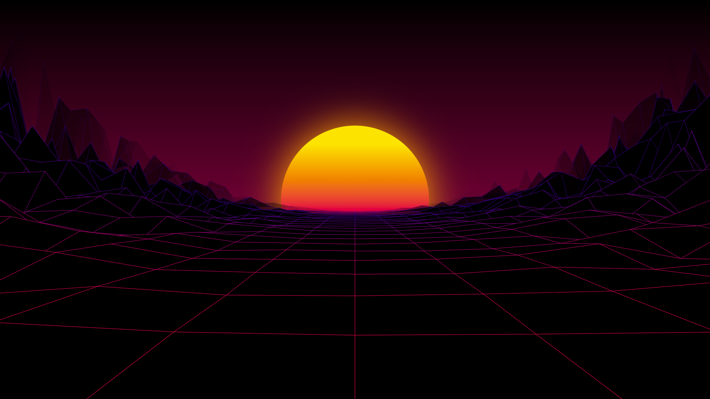

# Retro Synthwave

[live version](https://victorribeiro.com/random4)

## About

This is a project I've been working on for a while, one hour or less at at time. It involves a simple equation for calculating a perspective of a given point `FOV / (FOV + z)` Where FOV is the Field of View and z is the z coordinate of a given 3D point (x, y, z).

### Can I use it on my videos?
Yes, set up a record screen software and capture away.

### Can I use it as a backgroud?
Yes, press F11 to enter full screen mode, reload the page and take a screen shot.

### Can this turned into a endless GIF?
Yes, comment out the part where I reset the y position last row of points after they are gone, capture the frames and you're all set.
